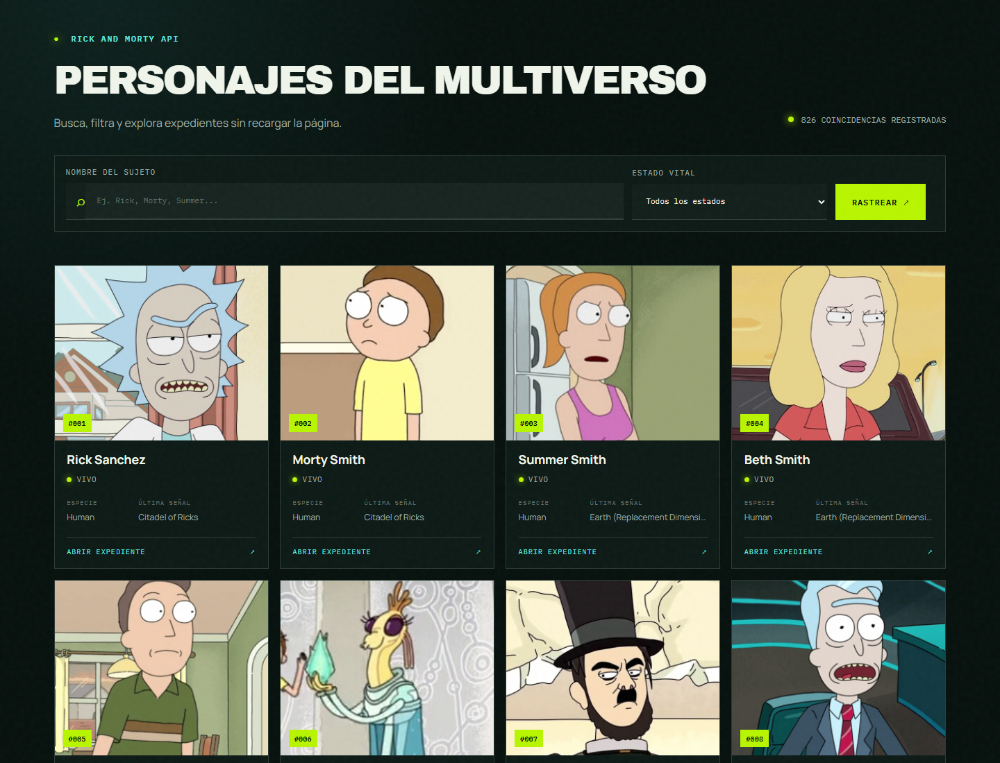
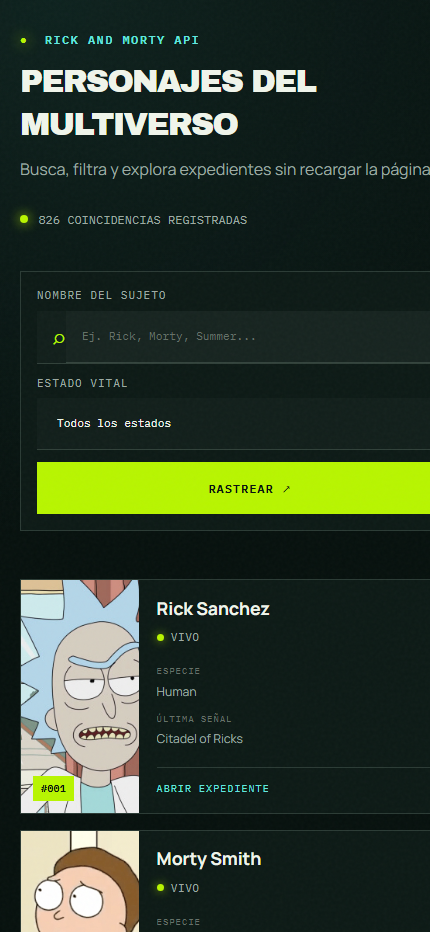

# MVVM — Rick and Morty Explorer

Ejemplo didáctico de **Modelo–Vista–VistaModelo (MVVM)** construido con Vanilla
JavaScript, Vite y la API pública de Rick and Morty.

La interfaz funciona como una **Single Page Application (SPA)**: se monta una
sola vez en `#app` y actualiza búsqueda, filtros, paginación y detalles sin
recargar el documento.

## Capturas

### Escritorio



### Móvil

<p align="center">
  
</p>

## Arquitectura

```text
Acción del usuario
       ↓
View ─────→ ViewModel ─────→ Model ─────→ Rick and Morty API
  ↑              │              │
  └── estado ────┘              └── personajes normalizados
```

### Model

`src/model` contiene los datos y el acceso externo:

- `Character.js` representa un personaje dentro de la aplicación.
- `RickAndMortyModel.js` construye consultas, ejecuta `fetch`, interpreta errores
  y transforma el JSON externo en objetos `Character`.
- No conoce el DOM ni importa la Vista o el ViewModel.

### Configuración

`src/config/environment.js` es el único punto que lee y valida variables de
entorno. `main.js` inyecta la URL configurada al Modelo, por lo que la capa de
datos no conoce Vite ni accede directamente a `import.meta.env`.

### ViewModel

`src/viewmodel/CharactersViewModel.js` mantiene el estado observable de la UI:

- personajes, filtros y página actual;
- carga, errores y personaje seleccionado;
- comandos para buscar, paginar, reintentar y abrir/cerrar detalles;
- cancelación de solicitudes anteriores para evitar resultados obsoletos.

No utiliza selectores ni modifica HTML. Esto permite probarlo sin navegador.

### View

`src/view/CharactersView.js` transforma el estado en HTML y traduce eventos del
DOM en comandos del ViewModel. No usa `fetch`, no construye URLs de la API y no
decide reglas de navegación.

### Composition Root

`src/main.js` es el único lugar que crea las tres piezas y conecta sus
dependencias.

## Funcionalidades

- listado paginado de personajes;
- búsqueda por nombre y filtro por estado;
- estados de carga, error y búsqueda vacía;
- detalle de personaje en un panel accesible;
- navegación responsive y soporte para movimiento reducido;
- catálogo mostrado directamente al abrir la SPA.

## Ejecutar

Requiere Node.js `20.19+` o `22.12+`.

```bash
npm run setup
npm install
npm run dev
```

El comando `npm run setup` crea el archivo `.env` local a partir de
`.env.example`. También puede hacerse manualmente:

```bash
cp .env.example .env
```

Variable disponible:

```env
VITE_API_BASE_URL=https://rickandmortyapi.com/api
```

`.env` está excluido de Git; solo se publica `.env.example`.

Vite mostrará la dirección local, normalmente `http://localhost:5173`.

## Verificar

```bash
npm test
npm run build
```

Las pruebas validan el mapeo del Modelo y el comportamiento del ViewModel sin
depender del DOM.

## API

El proyecto consulta `https://rickandmortyapi.com/api/character`. La API es
pública y no requiere claves ni configuración local.
